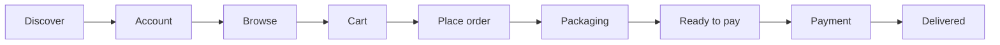
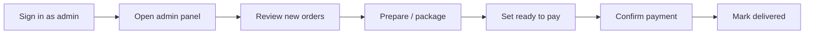

# Luchiz Farm — User journeys

This document defines who uses the app, what they do at each step, and how an order moves from browse to delivery.

---

## User types

| Role | Who | Access |
|------|-----|--------|
| **Guest** | Visitor, not signed in | Browse site, shop (`/order`), WhatsApp enquiry, PDF download. Cannot place tracked orders. |
| **Customer** | Registered user (`profiles.role = customer`) | Everything a guest can do, plus place orders, send for packaging, pay, view **My orders**. |
| **Admin** | Farm staff (`profiles.role = admin`) | Everything a customer can do, plus **`/admin`** — view all orders, update status, mark payment received. |

---

## Customer journey (happy path)

### Overview



### Step-by-step

| # | Stage | What the customer does | Where | System result |
|---|--------|------------------------|-------|----------------|
| 1 | **Discover** | Lands on homepage, reads about the farm, gallery, how to order | `/`, `/about`, `/gallery`, `/how-to-order` | No account required |
| 2 | **Create account** | Registers with name, phone, email, password; or signs in | `/login`, `/register` | Supabase Auth user + `profiles` row (`role: customer`) |
| 3 | **Browse produce** | Opens shop, switches Vegetables / Meat tabs, views price, stock | `/order` | Products loaded from Supabase |
| 4 | **Build cart** | Adjusts quantities (+ / −), reviews line items | `/order` (cart panel) | Cart held in browser until checkout |
| 5 | **Enter details** | Name, phone, delivery address, notes (pre-filled from profile when signed in) | `/order` | — |
| 6 | **Place order** | Taps **Place order** (must be signed in) | `/order` | Order created: `status = placed`, `payment_status = pending`, linked to `user_id` → redirect to order detail |
| 7 | **Send for packaging** | On order page, taps **Send order for packaging** | `/account/orders/:id` | `status = packaging` — farm is notified to prepare the order |
| 8 | **Wait for total** | Sees message that order is being prepared | `/account/orders/:id` | Customer cannot pay yet |
| 9 | **Ready to pay** | Admin sets order to ready; customer sees **Pay now** | `/account/orders/:id` | `status = ready_for_payment` |
| 10 | **Payment** | Taps **Call to pay** or **Pay via WhatsApp** (mobile money to farm number) | Phone / WhatsApp | Payment happens **outside** the app; customer uses order ID as reference |
| 11 | **Payment confirmed** | Admin marks payment received | — (customer may refresh order page) | `status = paid`, `payment_status = paid` |
| 12 | **Delivery** | Receives order; admin marks delivered | `/account/orders` | `status = delivered` |

### Customer actions by order status

| Order status | Customer can |
|--------------|----------------|
| `placed` | View order, **Send for packaging** |
| `packaging` | View order only (wait for farm) |
| `ready_for_payment` | View order, **Pay now** (call / WhatsApp) |
| `paid` | View order (payment confirmed) |
| `delivered` | View order (complete) |
| `cancelled` | View order (no further actions) |

### Tracking orders

- List: **`/account/orders`**
- Detail: **`/account/orders/:orderId`**
- Nav: **My orders** (when signed in)

---

## Guest journey (no account)

Guests can still use the farm site but orders are not saved in the system.

| Step | Action | Where |
|------|--------|-------|
| 1 | Browse marketing pages | `/`, `/about`, etc. |
| 2 | Browse products and build a cart | `/order` |
| 3 | Download PDF summary | `/order` |
| 4 | **Or message us on WhatsApp** — sends cart text via WhatsApp (no order ID in database) | `/order` |
| 5 | Prompted to **Sign in / Create account** if they tap **Place order** | Redirect to `/login` |

**Recommendation:** Encourage account creation so packaging, payment, and delivery are tracked in one place.

---

## Admin journey

### Overview



### Step-by-step

| # | Stage | What admin does | Where | System result |
|---|--------|-----------------|-------|----------------|
| 1 | **Access** | Signs in with admin account | `/login` | `profiles.role = admin` |
| 2 | **Dashboard** | Opens admin panel, filters by status | `/admin` | Sees all orders (newest first) |
| 3 | **New order** | Sees `placed` or `packaging` orders | `/admin` | Customer name, phone, items, total |
| 4 | **Prepare** | Picks/packs order; may contact customer on phone/WhatsApp if market-price items | Off-app | — |
| 5 | **Ready to pay** | Sets status to **Ready to pay** when total is final | `/admin` status dropdown | `status = ready_for_payment` — customer sees Pay button |
| 6 | **Payment received** | After mobile money, taps **Mark paid** or sets status to **Paid** | `/admin` | `payment_status = paid`, `status = paid` |
| 7 | **Deliver** | After handoff/delivery, sets **Delivered** | `/admin` | `status = delivered` |
| 8 | **Cancel** (if needed) | Sets **Cancelled** | `/admin` | `status = cancelled` |

### Admin responsibilities

| When customer status is… | Admin should… |
|--------------------------|---------------|
| `placed` | Acknowledge order; wait for or confirm customer sent for packaging |
| `packaging` | Prepare order; update stock; confirm final total (especially market-price items) |
| `ready_for_payment` | Wait for payment; verify reference on mobile money |
| `paid` | Arrange delivery or pickup |
| `delivered` | Close the order |

---

## Order & payment states (definitions)

### Order status (`orders.status`)

| Value | Label | Meaning |
|-------|--------|---------|
| `placed` | Order placed | Customer completed checkout; not yet sent for packaging |
| `packaging` | Sent for packaging | Customer requested preparation; farm is working on the order |
| `ready_for_payment` | Ready to pay | Total confirmed; customer may pay to the farm payment number |
| `paid` | Payment received | Farm confirmed payment |
| `delivered` | Delivered | Order fulfilled |
| `cancelled` | Cancelled | Order will not be fulfilled |

### Payment status (`orders.payment_status`)

| Value | Meaning |
|-------|---------|
| `pending` | No payment confirmed yet |
| `paid` | Payment received and recorded |
| `failed` | Reserved for future use |
| `refunded` | Reserved for future use |

### Allowed flow (normal path)

```
placed → packaging → ready_for_payment → paid → delivered
```

Admin may set **cancelled** from most states. Admin can jump status via dropdown when operational needs require it (use carefully).

---

## Touchpoints map

| Page | Guest | Customer | Admin |
|------|-------|----------|-------|
| `/` | ✓ | ✓ | ✓ |
| `/order` | Browse, WhatsApp, PDF | + Place order | ✓ |
| `/login`, `/register` | ✓ | ✓ | ✓ |
| `/account/orders` | — | ✓ | ✓ (own orders) |
| `/account/orders/:id` | — | Packaging, pay | ✓ |
| `/admin` | — | — | ✓ |

---

## Payment model (current)

- Payment is **manual**: mobile money or phone to the number in `VITE_PAYMENT_PHONE` (default `+260 979 654 602`).
- The app does **not** process card or wallet payments inside the browser.
- Customer uses **order ID** as payment reference.
- Admin **Mark paid** is the source of truth for `payment_status`.

---

## Success criteria (per role)

### Customer

- Can register and sign in without errors.
- Can place an order and see it in **My orders**.
- Understands when to send for packaging and when to pay.
- Can reach the farm payment number in one tap when ready.

### Admin

- Sees every customer order in one list.
- Can move orders through packaging → pay → delivered.
- Can confirm payment after checking mobile money.

### Business (Luchiz Farm)

- Fewer lost WhatsApp-only orders; every paid flow has an order ID.
- Clear handoff between kitchen/packaging and payment/delivery.

---

## Related files

| Topic | Location |
|-------|----------|
| Status labels & rules | `src/lib/order-status.ts` |
| API / database calls | `src/lib/data-service.ts` |
| Payment phone & WhatsApp links | `src/lib/constants.ts` |
| Supabase setup & SQL | `supabase/README.md`, `supabase/migrations/001_auth_orders.sql` |
